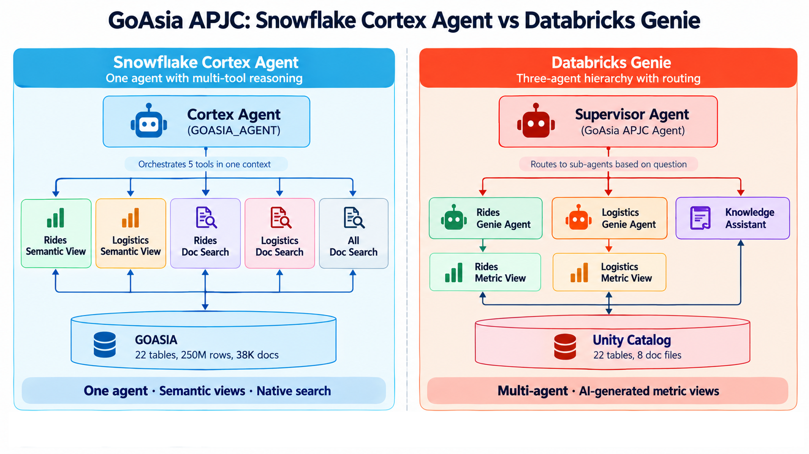

# GoAsia APJC TechUp: Hands-on Lab

**Snowflake Cortex Agents vs. Databricks Genie Agents**

In this hands-on lab (HOL), you build the same AI data agent twice, once on **Snowflake** and once on **Databricks**, using the same dataset. Then you ask both agents the same 23 benchmark questions and score their answers.

The agent has to answer business questions from **structured tables** (numbers: what happened) and **unstructured documents** (text: why it happened). It also has to decide which source to use for each question.

---

## Start here

| Document | Purpose |
|---|---|
| [Participant guide](techup_participant_guide.md) | Step-by-step instructions for the whole lab |
| [Benchmark test questions](benchmark_test_questions.md) | The 23 questions, expected answers and scoring sheet |

---

## The scenario: GoAsia

GoAsia is a fictional super-app operating across **10 APJC markets**, with two business lines on one platform:

| Part | What it contains | Size |
|---|---|---|
| **Rides** | Riders, drivers, vehicles, trips, trip events, payments, driver earnings, promotions, surge pricing | ~141M rows |
| **Logistics** | Shippers, couriers, warehouses, parcel types, shipments, route legs, parcel events, SLA breaches, courier earnings, invoices | ~109M rows |
| **Shared dimensions** | Country → city → zone, used by both domains | 10 markets |
| **Documents** | Support chats, rider complaints, driver surveys, incident reports, safety audits, news, regulatory filings, market research | 38,000 documents |

<p align="center"></p>

---

## What you build

<p align="center"></p>

| Layer | Snowflake | Databricks |
|---|---|---|
| Business meaning | 2 semantic views (Guided wizard + Autopilot) | 2 metric views (Genie Code) |
| Structured Q&A | Cortex Analyst | 2 Genie agents (Rides, Logistics) |
| Documents | Cortex Search (3 pre-built services) | Knowledge Assistant (pre-built) |
| Orchestration | **One** Cortex Agent with 5 tools | A Supervisor Agent routing to 3 sub-agents |
| Chat interface | Snowflake CoWork | Supervisor Agent chat |

**Snowflake:** one agent holds all five tools in a single context, so it can query numbers and search documents in the same answer.

**Databricks:** a Supervisor Agent routes each question to sub-agents. Each sub-agent sees only its own domain.

---

## Lab flow

| Part | What you do |
|---|---|
| **1–3. Introduction** | Get to know the dataset, the data model and the two architectures |
| **4. Snowflake** | Create your workspace and database, build the Rides and Logistics semantic views, build the Cortex Agent and add it to CoWork |
| **5. Databricks** | Build two metric views, two Genie agents and a Supervisor Agent |
| **6. Compare the results** | Check your configuration, run the 23 benchmark questions on both agents and score them |

---

## Before you start

- **Snowflake** and **Databricks** logins, provided by the TechUp session owner.
- A modern browser. You do everything in the UI, so there's nothing to install.
- Your **personal prefix:** first initial plus surname, in lowercase (for example, Jane Doe → `jdoe`). The accounts are shared, so every object you create starts with this prefix.

The source data is **read-only**. Everything you build goes into your own database or schema.

---

## What the benchmark tests

The 23 questions cover three kinds of tasks:

- **Structured data:** choosing the right column, filter and join. The data has look-alike columns, for example `status` vs `is_completed` and `fare` vs `total_fare_amount`.
- **Documents:** finding and summarising the right documents, filtered by `doc_type`.
- **Hybrid:** combining numbers with the documents that explain them, for example SLA breaches plus incident reports.

---

## Repository layout

```text
.
├── README.md                     # This file
├── techup_participant_guide.md   # Lab instructions
├── benchmark_test_questions.md   # Benchmark questions and scoring
└── images/                       # Screenshots (sf_*, dbx_*) and diagrams
```
