# GoAsia APJC TechUp: Hands-on Lab Participant Guide

**Snowflake Cortex Agents vs. Databricks Genie Agents**

In this hands-on lab you build the same AI data assistant twice, once on Snowflake and once on Databricks, using the same dataset. Then you ask both assistants the same benchmark questions and compare their answers.

| Part | What you do | Sections |
|---|---|---|
| **Introduction** | Get to know the GoAsia dataset and the two architectures. | [1. Meet GoAsia](#1-meet-goasia) · [2. Data model](#2-the-data-model) · [3. What you are comparing](#3-what-you-are-comparing) |
| **Snowflake** | Build two semantic views and a Cortex Agent, then add the agent to Snowflake CoWork. | [4.1 Log in](#41-log-in-and-verify-access) · [4.2 Rides SV](#42-create-the-rides-semantic-view) · [4.3 Logistics SV](#43-create-the-logistics-semantic-view) · [4.4 Agent](#44-create-the-goasia-cortex-agent) · [4.5 CoWork](#45-add-the-agent-to-snowflake-cowork) |
| **Databricks** | Build two metric views, two Genie agents and a Supervisor Agent. | [5.1 Log in](#51-log-in-and-verify-access) · [5.2 Source data](#52-reference-source-data-in-unity-catalog) · [5.3 Metric views](#53-create-the-metric-views-with-genie-code) · [5.4 Genie agents](#54-create-the-genie-agents) · [5.5 Supervisor](#55-create-the-supervisor-agent) |
| **Benchmark** | Run 23 benchmark questions on both agents and score the answers. | [6. Compare the results](#6-compare-the-results) |

---

## 1. Meet GoAsia

GoAsia is a fictional **super-app** operating across **10 APJC markets**. One customer can book a ride in Singapore in the morning and send a parcel in Jakarta in the afternoon. Both businesses run on the same app and share the same markets, cities and zones.

---

## 2. The data model

<p align="center">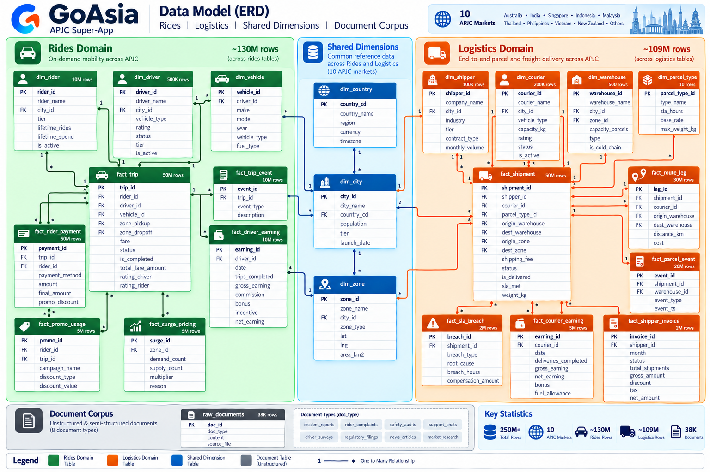</p>

The GoAsia data has three parts. The colours match the ERD above:

| Part | ERD colour | What it contains | Size |
|---|---|---|---|
| **Rides domain** | Green | Riders, drivers, vehicles, trips, trip events, payments, driver earnings, promotions, surge pricing | ~141M rows |
| **Logistics domain** | Orange | Shippers, couriers, warehouses, parcel types, shipments, route legs, parcel events, SLA breaches, courier earnings, invoices | ~109M rows |
| **Shared dimensions** | Blue | Country → city → zone, used by both domains | 10 markets |

Next to the tables is a corpus of **38,000 unstructured documents** (`raw_documents`). Each document has one of eight `doc_type` values, in three groups:

- **Customer voice:** `support_chats`, `rider_complaints`, `driver_surveys`
- **Operations and risk:** `incident_reports`, `safety_audits`
- **Market context:** `news_articles`, `regulatory_filings`, `market_research`

**Why you need both kinds of data.** The tables tell you **what** happened. The documents tell you **why**. For example, the `fact_sla_breach` table shows that SLA breaches in a city went up last quarter. The incident reports and courier complaints for that city explain the cause. A useful agent has to combine the two.

---

## 3. What you are comparing

<p align="center">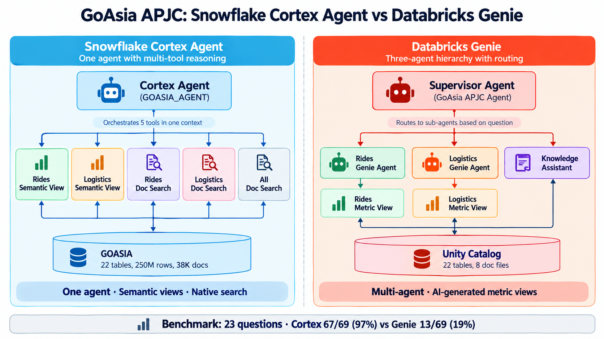</p>

Both platforms use the **same 22 tables and 38,000 documents**, and both answer the **same 23 benchmark questions**. The difference is how each platform is built to reason across them.

**Snowflake (left of the diagram): one agent with several tools.** A single Cortex Agent has five tools: two Cortex Analyst tools (one per domain semantic view) and three Cortex Search services. All five tools are available to the agent at the same time. For a question such as "why did SLA breaches rise in Manila?", it can query the numbers and search the documents, then combine both in one answer.

**Databricks (right of the diagram): three agents in a hierarchy.** A Supervisor Agent receives the question and routes it to one or more sub-agents: the Rides Genie agent, the Logistics Genie agent and the Knowledge Assistant. Each sub-agent sees only its own domain, so answer quality depends on the Supervisor routing the question correctly and combining the results.

| Layer | Snowflake | Databricks |
|---|---|---|
| Business meaning | Semantic views (Guided wizard + Autopilot) | Metric views (Genie Code) |
| Structured Q&A | Cortex Analyst | Genie agents (Rides, Logistics) |
| Documents | Cortex Search (3 services) | Knowledge Assistant |
| Orchestration | One Cortex Agent with 5 tools | Supervisor Agent routing to 3 sub-agents |

---

## 4. Snowflake

| Already set up for you (in `GOASIA`, read-only) | You build (in your own database) |
|---|---|
| 22 Rides, Logistics and shared tables with sample data | Your private workspace and personal database |
| `raw_documents`, holding the 38,000 documents | **Rides** semantic view |
| Three Cortex Search services in `GOASIA.SEARCH_SERVICES`: `RIDES_DOC_SEARCH`, `LOGISTICS_DOC_SEARCH` and `ALL_DOC_SEARCH` | **Logistics** semantic view |
| Warehouse `COMPUTE_WH` and role `SYSADMIN` | A **Cortex Agent** that uses both semantic views and all three search services |
| Snowflake CoWork | The agent added to CoWork, ready for the benchmark |

### 4.1 Log in and verify access

| Item | Value |
|---|---|
| Snowsight URL | https://app.snowflake.com/sfseapac/apjtechup26 |
| Login | Username and password provided by the TechUp session owner |
| Role / Warehouse | `SYSADMIN` / `COMPUTE_WH` |
| Your private workspace | `<first initial><surname>-techuphol` (e.g. `jdoe-techuphol`) |
| Your personal database | `<first initial><surname>-techup-db` (e.g. `jdoe-techup-db`) |

#### Step 1: Log in and create your private workspace

1. Open the Snowsight URL above and sign in with the username and password provided by the TechUp session owner. If you are prompted to set a new password, do so.
2. In the left navigation, go to **Projects » Workspaces**.
3. Click **+** next to the search icon, then select **Create new » Private workspace**, and name it `<first initial><surname>-techuphol`.
4. In the new workspace, click **+ Add new » SQL File** and name it `setup.sql`.

<p align="center">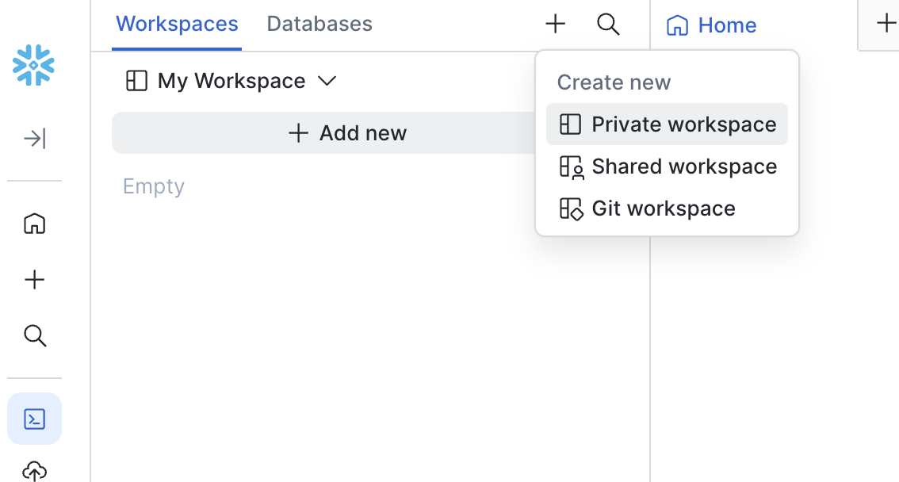</p>

#### Step 2: Create your personal database

Paste the script below into `setup.sql`. **Edit only the first line:** replace `<first initial><surname>` with your prefix. Then run the script.

```sql
-- EDIT THIS LINE ONLY
SET my_db = '"<first initial><surname>-techup-db"';

USE ROLE SYSADMIN;
USE WAREHOUSE COMPUTE_WH;

CREATE DATABASE IF NOT EXISTS IDENTIFIER($my_db);
USE DATABASE IDENTIFIER($my_db);
```

> [!IMPORTANT]
> Create everything you build (semantic views and the agent) in **your** database. `GOASIA` holds read-only source data. Your database name contains hyphens, so whenever you type it directly, wrap it in double quotes and keep it lowercase, for example `"jdoe-techup-db"`.

#### Step 3: Verify access to the shared objects

In the same file, run the following queries and check each result against the expected values in the comments:

```sql
-- 1. Context: expect your user, SYSADMIN, COMPUTE_WH, your database
SELECT CURRENT_USER(), CURRENT_ROLE(), CURRENT_WAREHOUSE(), CURRENT_DATABASE();

-- 2. Tables: expect 3 / 9 / 10 / 2
SELECT table_schema, COUNT(*) AS tables
FROM GOASIA.INFORMATION_SCHEMA.TABLES
WHERE table_schema IN ('SHARED','RIDES','LOGISTICS','DOCUMENTS')
GROUP BY 1 ORDER BY 1;

-- 3. Sample row counts: expect 10 / 50,000,000 / 50,000,000 / 38,000
SELECT
  (SELECT COUNT(*) FROM GOASIA.SHARED.DIM_COUNTRY)        AS countries,
  (SELECT COUNT(*) FROM GOASIA.RIDES.FACT_TRIP)           AS trips,
  (SELECT COUNT(*) FROM GOASIA.LOGISTICS.FACT_SHIPMENT)   AS shipments,
  (SELECT COUNT(*) FROM GOASIA.DOCUMENTS.RAW_DOCUMENTS)   AS documents;

-- 4. Cortex Search services: expect 3 rows, all ACTIVE
SHOW CORTEX SEARCH SERVICES IN SCHEMA GOASIA.SEARCH_SERVICES;

-- 5. Test a search: expect 3 matching documents
SELECT SNOWFLAKE.CORTEX.SEARCH_PREVIEW(
  'GOASIA.SEARCH_SERVICES.RIDES_DOC_SEARCH',
  '{"query": "driver safety complaints in Jakarta", "columns": ["doc_type","content"], "limit": 3}'
);
```

Your workspace should now look like the screenshot below. Check that the context bar at the top right shows **SYSADMIN**, **COMPUTE_WH** and your database.

<p align="center">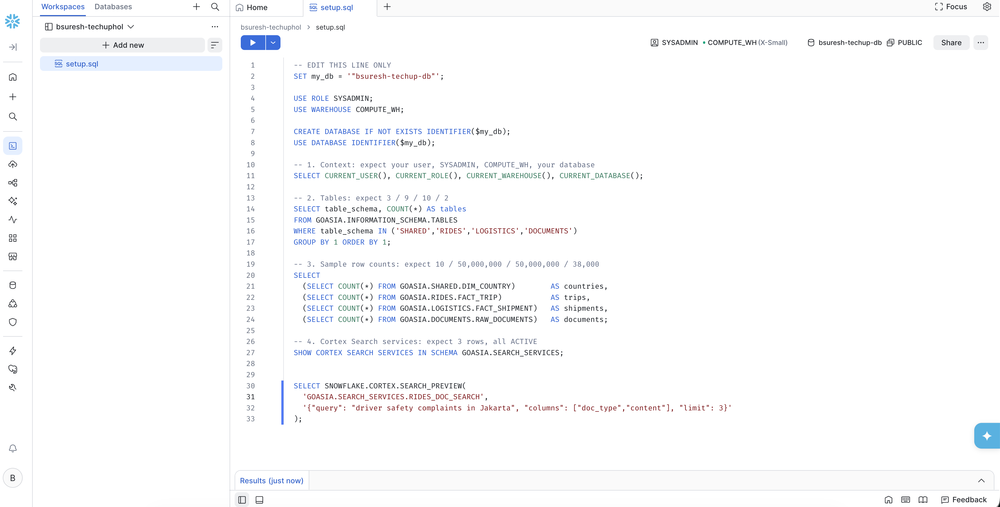</p>

---

### 4.2 Create the Rides semantic view

You'll build `RIDES_SEMANTIC_VIEW` with the **Guided wizard** in your private workspace. It covers 12 tables: the 9 `GOASIA.RIDES` tables and the 3 `GOASIA.SHARED` tables. You'll save it in your own database, `<first initial><surname>-techup-db`.PUBLIC.

#### Step 1: Start the Guided wizard

1. In your workspace, click **+ Add new » Semantic view** and name the file `RIDES_SEMANTIC_VIEW.sv.yaml`.
2. Select **Guided wizard**. It takes you through tables, columns and context step by step, with no YAML required.
3. On **Provide context**, you don't need SQL queries or Tableau, Power BI or Ossie files. Click **Skip**.

<p align="center">
  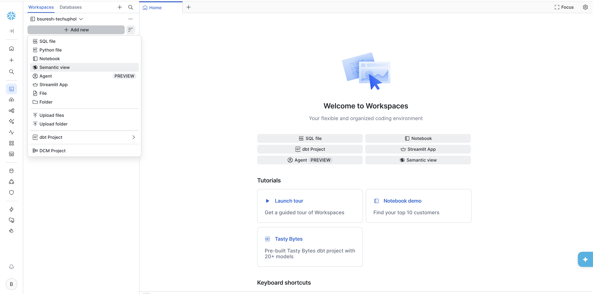
  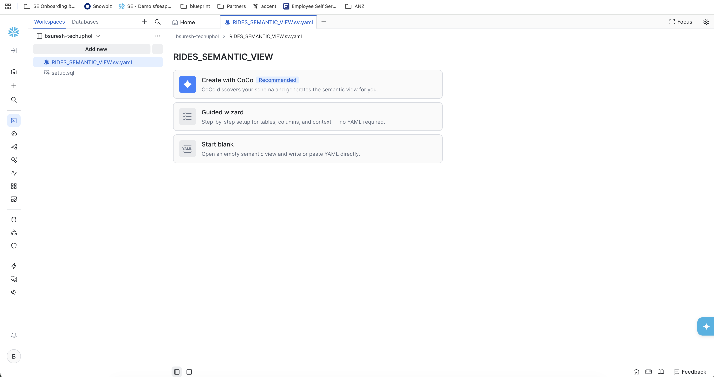
  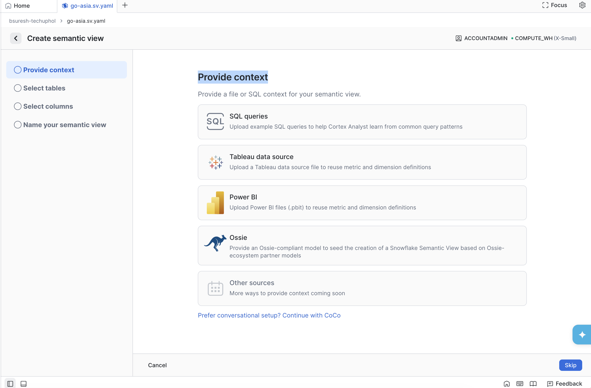
</p>

#### Step 2: Select the tables

1. Expand **GOASIA » RIDES** and select all 9 tables: `DIM_DRIVER`, `DIM_RIDER`, `DIM_VEHICLE`, `FACT_DRIVER_EARNING`, `FACT_PROMO_USAGE`, `FACT_RIDER_PAYMENT`, `FACT_SURGE_PRICING`, `FACT_TRIP` and `FACT_TRIP_EVENT`.
2. Expand **GOASIA » SHARED** and select `DIM_CITY`, `DIM_COUNTRY` and `DIM_ZONE`.
3. Check that the **Selected** counter shows **12**, then click **Next**.

<p align="center">
  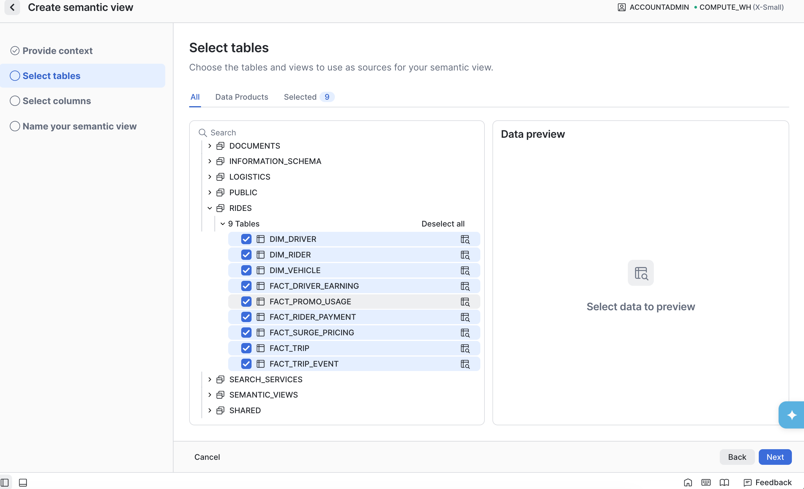
  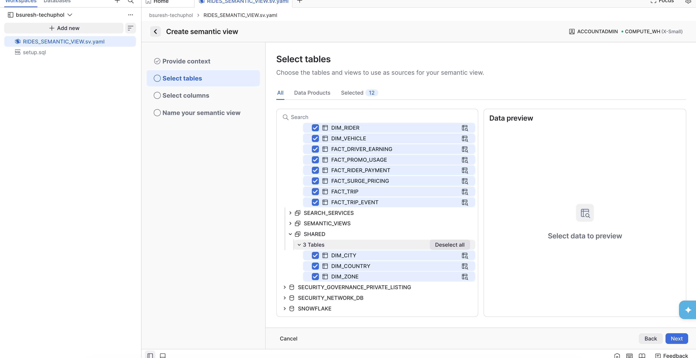
</p>

> [!NOTE]
> **Don't select any `LOGISTICS` tables. They go in a separate semantic view.**

#### Step 3: Select columns, then name and place the view

1. Keep **all columns** selected. The counter should show **Columns (101 selected)**. If it doesn't, click **Select all**.
2. Select **Add sample values** (gives Cortex Analyst real values to match on) and **Add descriptions** (AI writes a description for every table and column). Click **Next**.
3. Set **Name** to `RIDES_SEMANTIC_VIEW`. Leave **Target name** as `RIDES_SEMANTIC_VIEW`.
4. Click **Select database and schema**, then select your database (`<first initial><surname>-techup-db`) and the **PUBLIC** schema.
5. Click **Publish**.

<p align="center">
  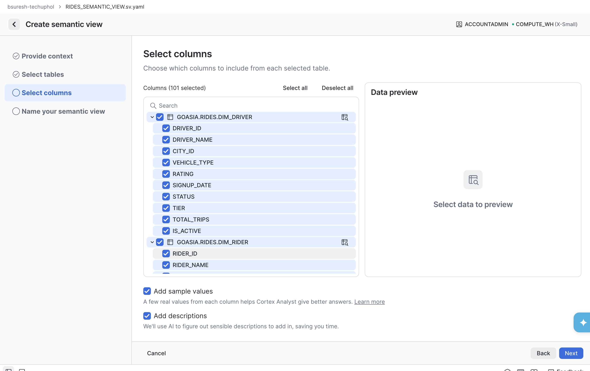
  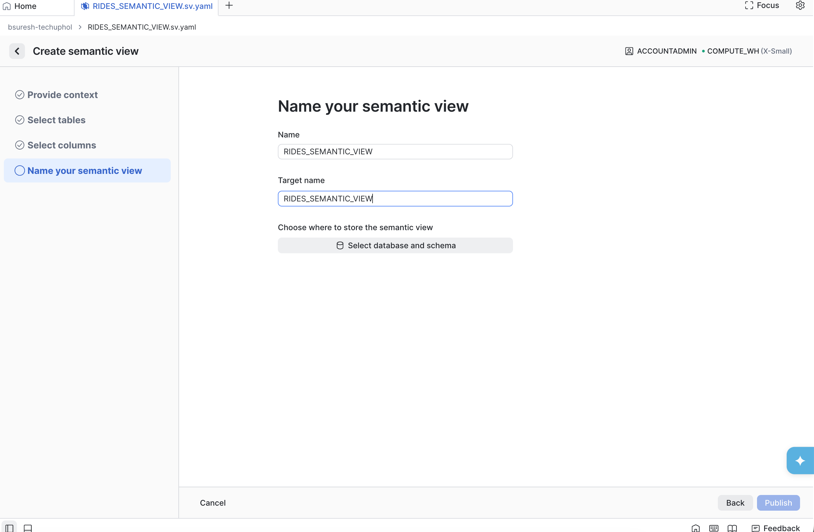
  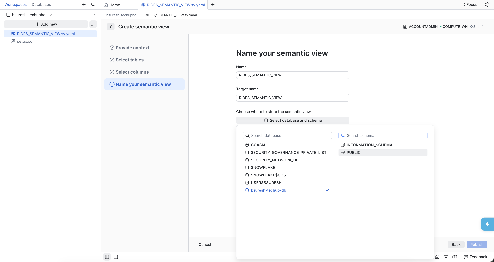
</p>

#### Step 4: Wait for generation, then add a description

Autopilot now builds the semantic view: logical tables, descriptions, sample values and relationships. This usually takes **1–2 minutes**, although the screen says up to 10. **Don't close the window.** Suggestions appear in the **Suggestions** panel on the right as they become available.

<p align="center">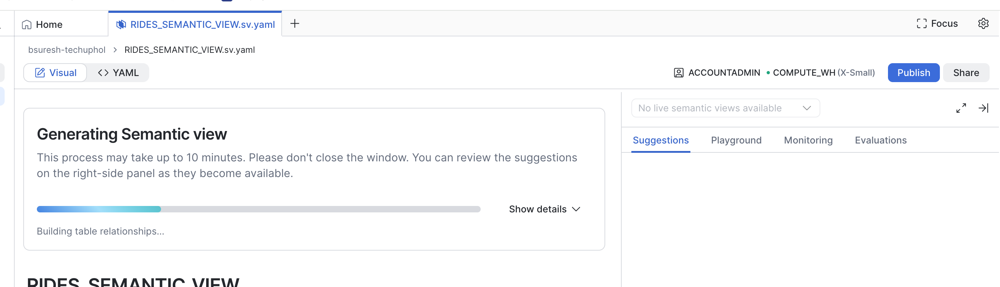</p>

When generation finishes, set the semantic view's description at the top of the **Visual** editor to:

```text
GoAsia ride-hailing operations across APJC
```

#### Step 5: Accept all Autopilot suggestions

> [!IMPORTANT]
> **Accept every suggestion Autopilot generates, including metrics, dimensions, facts, filters, relationships and synonyms. Don't dismiss any. Later steps depend on them.**

In the **Suggestions** panel, work through each category (Metrics, Dimensions, Facts, Filters and Relationships):

1. Expand the category and click **Review** on a suggestion.
2. The suggestion opens in the editor on the left. Click **Keep** for metrics, dimensions, facts and filters, or click **✓** in the **Add relationship** form.
3. Repeat until the category's count reaches **0**.

For example: **Metrics** `dim_city · distinct_country_count` » **Review** » **Keep** (left), and **Relationships** `DIM_CITY_TO_DIM_COUNTRY` (many-to-one on `COUNTRY_CD`) » **Review** » **✓** (right). Accept all relationships, including `DIM_DRIVER_TO_DIM_CITY`, `DIM_RIDER_TO_DIM_CITY` and the fact-to-dimension joins.

<p align="center">
  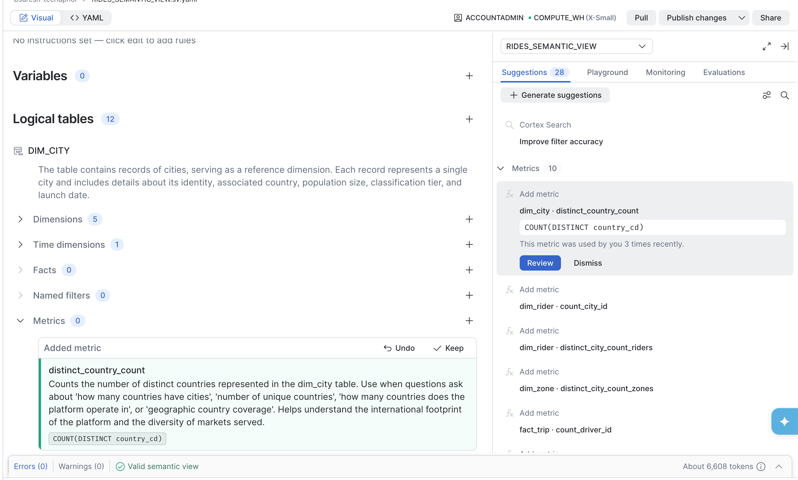
  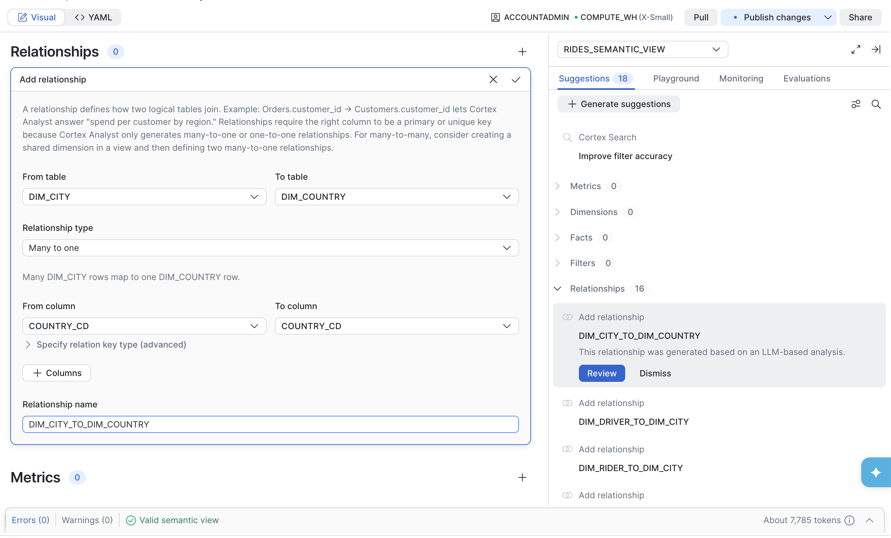
</p>

Before you publish, check that the status bar at the bottom shows **Errors (0)** and **Valid semantic view**. Skip **Verified queries** for now.

#### Step 6: Publish your changes and verify

1. Click **Publish changes** (top right). Check that `RIDES_SEMANTIC_VIEW` is selected (it shows *Out of sync*), then click **Publish**.
2. In **Review publish changes**, confirm that the target is `"<first initial><surname>-techup-db".PUBLIC` and review the changes. Click **Publish**. The *Overwrite warning* is expected: it replaces the version created in Step 3 with your enriched version.

<p align="center">
  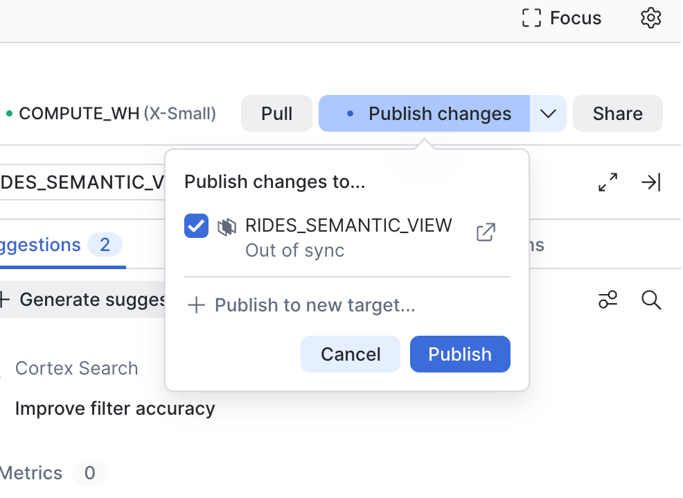
  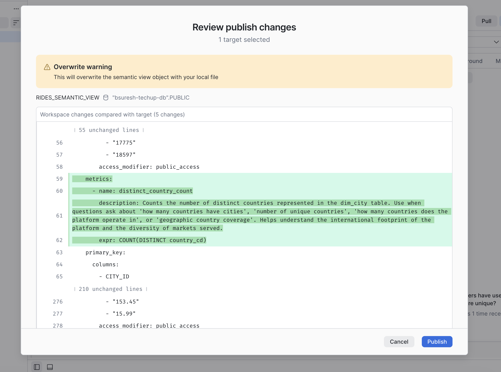
</p>

3. Run the following in `setup.sql`. `RIDES_SEMANTIC_VIEW` should be listed.

   ```sql
   USE DATABASE IDENTIFIER($my_db);
   SHOW SEMANTIC VIEWS IN SCHEMA PUBLIC;
   ```

4. To test it, open the **Playground** tab and ask: *"How many trips were completed per country last month?"*

---

### 4.3 Create the Logistics semantic view

Repeat the wizard to build `LOGISTICS_SEMANTIC_VIEW`. It covers 11 tables: 9 `GOASIA.LOGISTICS` tables and 2 `GOASIA.SHARED` tables. The screens are the same as in [4.2](#42-create-the-rides-semantic-view).

#### Step 1: Start the wizard and select the tables

1. In your workspace, click **+ Add new » Semantic view** and name the file `LOGISTICS_SEMANTIC_VIEW.sv.yaml`.
2. Select **Guided wizard**, then click **Skip**.
3. Expand **GOASIA » LOGISTICS** and **GOASIA » SHARED**, then select exactly these 11 tables:
   - **GOASIA.LOGISTICS (9):** `FACT_SHIPMENT`, `DIM_SHIPPER`, `DIM_COURIER`, `DIM_WAREHOUSE`, `DIM_PARCEL_TYPE`, `FACT_SLA_BREACH`, `FACT_COURIER_EARNING`, `FACT_SHIPPER_INVOICE`, `FACT_ROUTE_LEG`
   - **GOASIA.SHARED (2):** `DIM_CITY`, `DIM_COUNTRY`
4. Check that the **Selected** counter shows **11**, then click **Next**.

> [!IMPORTANT]
> **Don't use Select all on LOGISTICS. Select the 9 tables above one by one. Leave `SHARED.DIM_ZONE` unselected, because zones apply only to Rides.**

#### Step 2: Select columns, name and place the view

1. Keep **all columns** selected. If any are missing, click **Select all**.
2. Select **Add sample values** and **Add descriptions**, then click **Next**.
3. Set **Name** and **Target name** to `LOGISTICS_SEMANTIC_VIEW`.
4. Click **Select database and schema**, then select your database (`<first initial><surname>-techup-db`) and the **PUBLIC** schema.
5. Click **Publish**, and wait about **1–2 minutes** for generation. Don't close the window.

#### Step 3: Add a description and accept all suggestions

In the **Visual** editor, set the semantic view's description to:

```text
GoAsia logistics and delivery operations across APJC
```

> [!IMPORTANT]
> **Accept every suggestion, including metrics, dimensions, facts, filters, relationships and synonyms. Don't dismiss any.**

Work through the suggestions as in [4.2, Step 5](#step-5-accept-all-autopilot-suggestions): **Review** » **Keep** (or **✓** for relationships) until every category shows **0**. The status bar should show **Errors (0)** and **Valid semantic view**. Skip **Verified queries** for now.

#### Step 4: Publish your changes and verify

1. Click **Publish changes**. Check that `LOGISTICS_SEMANTIC_VIEW` is selected, then click **Publish**.
2. In **Review publish changes**, confirm that the target is `"<first initial><surname>-techup-db".PUBLIC`, then click **Publish**.
3. Run the query below. Both `RIDES_SEMANTIC_VIEW` and `LOGISTICS_SEMANTIC_VIEW` should now be listed.

   ```sql
   USE DATABASE IDENTIFIER($my_db);
   SHOW SEMANTIC VIEWS IN SCHEMA PUBLIC;
   ```

4. To test the new view, open **Playground** and ask: *"Which shippers had the most SLA breaches last quarter?"*

---

### 4.4 Create the GoAsia Cortex Agent

Next you'll build a single agent that answers questions using both semantic views and the three document search services.

#### Step 1: Create the agent

1. In the left navigation, go to **AI & ML » Agent Studio** and click **Create agent** (top right).
2. Under **Database and schema**, select your database (`<first initial><surname>-techup-db`) and **PUBLIC**.
3. Set **Agent object name** to `<first initial><surname>_goasia_agent`, using **underscores** (for example, `jdoe_goasia_agent`). The display name fills in automatically.
4. Click **Create agent**.

<p align="center">
  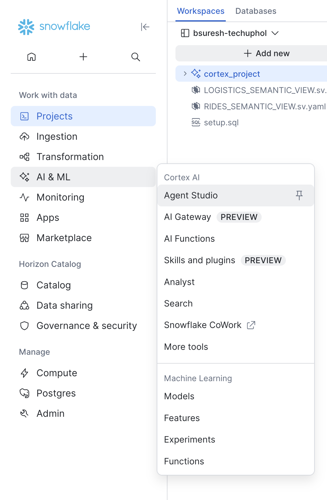
  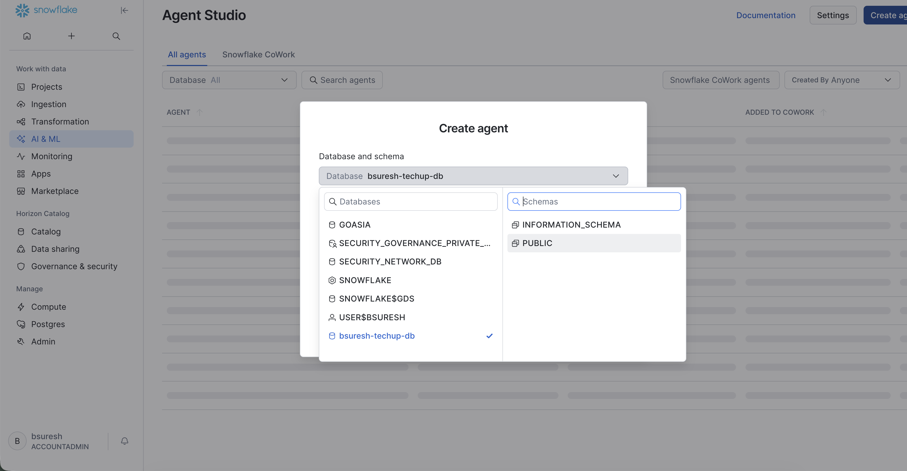
  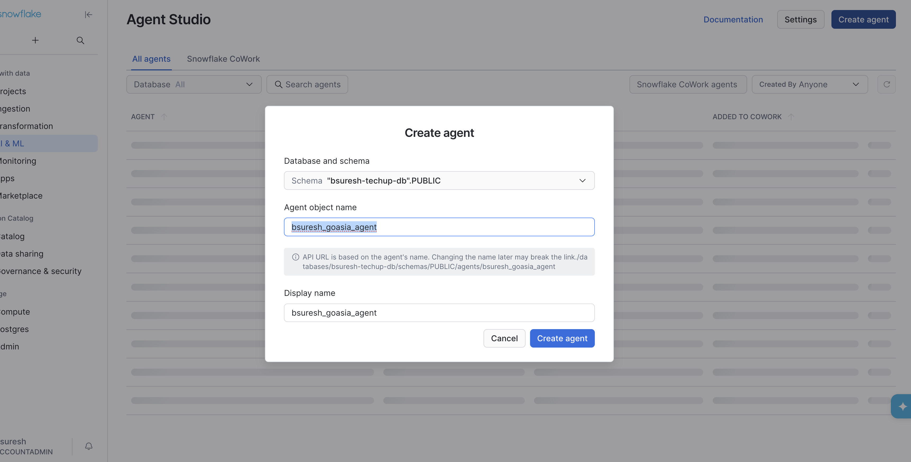
</p>

> [!NOTE]
> The agent's API URL is based on its object name, so don't rename the agent later.

#### Step 2: Set the description and orchestration instructions

1. Open the **Configuration** tab, select **General**, and set **Description** to:

   ```text
   GoAsia super-app agent — covers Rides, Logistics, and document search across APJC operations
   ```

2. Select **Instructions**. Leave **Model** set to `auto`, and paste the following into **Orchestration instructions**:

   ```text
   You are GoAsia's data assistant covering ride-hailing and logistics operations across 8 APJC markets (Singapore, Malaysia, Thailand, Philippines, Vietnam, Indonesia, India, Japan, Australia, South Korea).

   TOOL ROUTING:
   - Structured data questions (counts, revenue, metrics, rankings) → use RIDES_analyst or logistics_analyst
   - Ride document questions (incidents, complaints, audits, support chats, driver surveys) → use RIDES_DOC_SEARCH
   - Logistics document questions (regulatory filings, news articles, market research) → use LOGISTICS_DOC_SEARCH
   - Cross-domain or ambiguous document questions → use ALL_DOC_SEARCH
   - When a question spans both rides and logistics, query both semantic views and combine results
   - When unsure which domain, ask the user to clarify rides or logistics
   ```

3. Select **Tools** and switch the **Code Execution tool** toggle **on**. Leave **Artifact repository** empty.

<p align="center">
  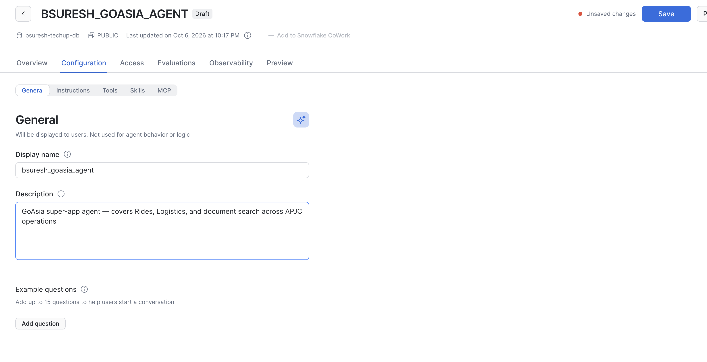
  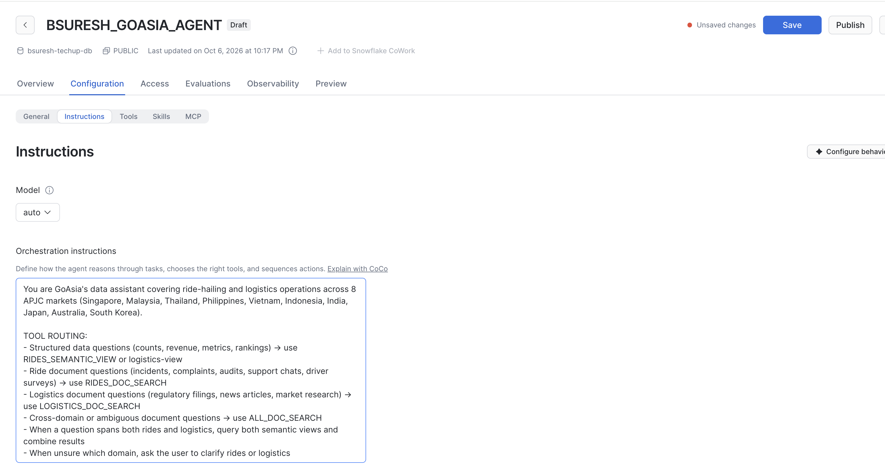
  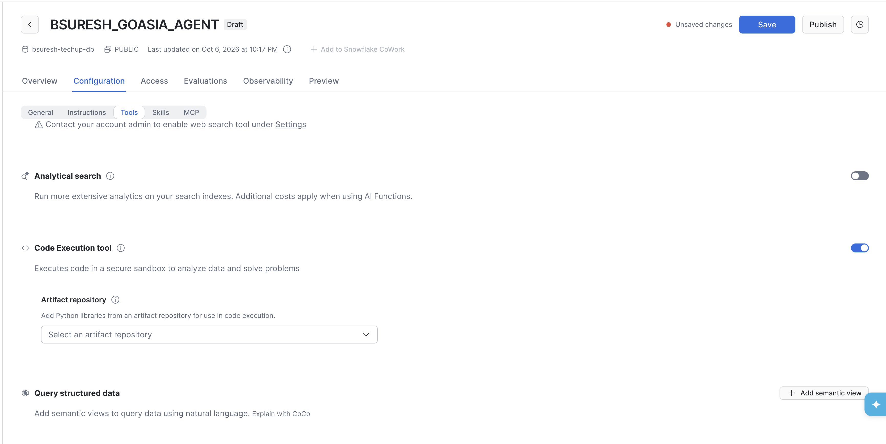
</p>

#### Step 3: Add the two semantic view tools

1. Under **Query structured data**, click **+ Add semantic view » Add semantic view**.
2. Under **Cortex Analyst**, select the schema `"<first initial><surname>-techup-db".PUBLIC`, then select **LOGISTICS_SEMANTIC_VIEW**.
3. Fill in the tool details from the table below, then click **Add**.
4. Repeat items 1–3 for **RIDES_SEMANTIC_VIEW**.

| Field | Logistics tool | Rides tool |
|---|---|---|
| **Semantic view** | **LOGISTICS_SEMANTIC_VIEW** | **RIDES_SEMANTIC_VIEW** |
| **Name** | `logistics_analyst` | `RIDES_analyst` |
| **Description** | Click **Generate with Cortex** and wait for the text to fill in. Don't type it yourself. | **Generate with Cortex** |
| **Warehouse** | Select **Custom**, then `COMPUTE_WH` | **Custom** » `COMPUTE_WH` |
| **Query timeout** | Leave blank | Leave blank |

<p align="center">
  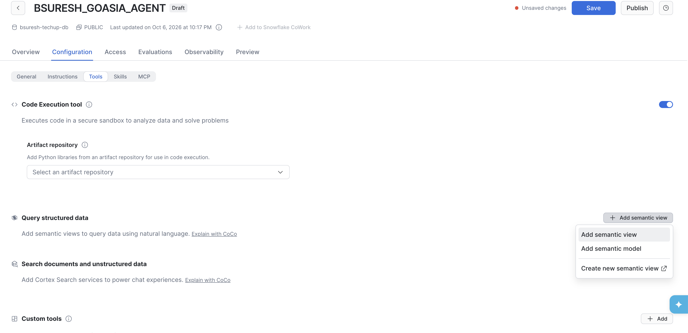
  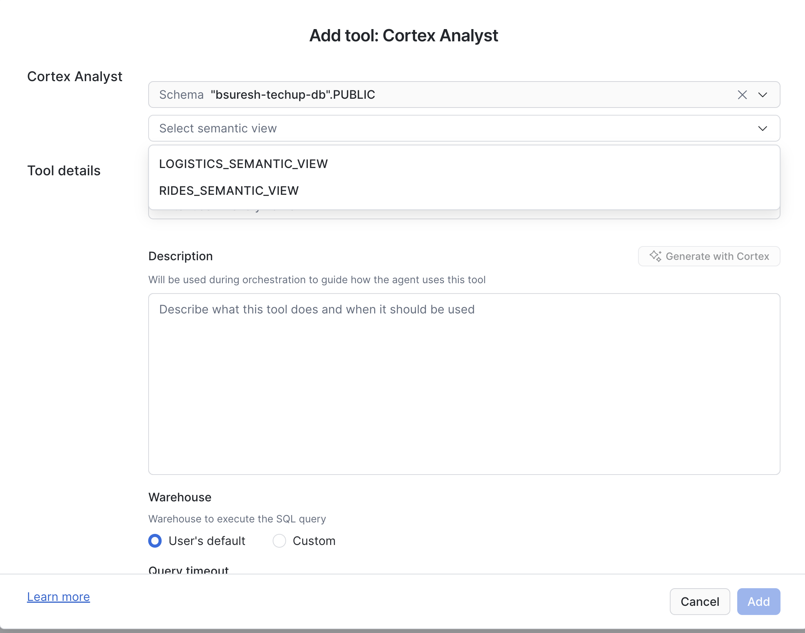
  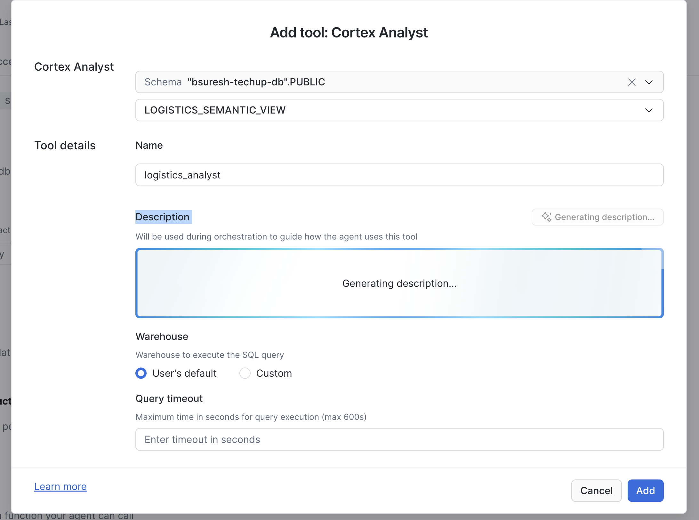
</p>

> [!IMPORTANT]
> Use **Generate with Cortex** for the description and set the warehouse to **Custom » `COMPUTE_WH`**. The agent relies on both settings.

#### Step 4: Add the Cortex Search tools

> [!IMPORTANT]
> Don't create new search services. Select the existing services in `GOASIA.SEARCH_SERVICES`.

1. Scroll to **Search documents and unstructured data** and click **+ Add search service » Add search service**.
2. In **Database**, select **GOASIA**, then the schema **SEARCH_SERVICES**.
3. In **Search service**, select `GOASIA.SEARCH_SERVICES.RIDES_DOC_SEARCH`. Leave **Name** as `RIDES_DOC_SEARCH`, and paste the description from the table below.
4. Under **Advanced configuration**, set **Max results** to `10`, **ID column** to `DOC_ID` and **Title column** to `DOC_TYPE`. Leave **Target results** empty.
5. Click **Add**.
6. Repeat items 1–5 for the other two services, with the same advanced configuration.

| Search service | Name | Description |
|---|---|---|
| `GOASIA.SEARCH_SERVICES.RIDES_DOC_SEARCH` | `RIDES_DOC_SEARCH` | `Search ride-hailing documents including incident reports, rider complaints, safety audits, support chat transcripts, and driver surveys across 8 APJC markets` |
| `GOASIA.SEARCH_SERVICES.LOGISTICS_DOC_SEARCH` | `LOGISTICS_DOC_SEARCH` | `Search logistics documents including regulatory filings, news articles, and market research reports covering delivery operations and supply chain across APJC` |
| `GOASIA.SEARCH_SERVICES.ALL_DOC_SEARCH` | `ALL_DOC_SEARCH` | `Search across all GoAsia operational documents spanning both rides and logistics domains — use when the question covers both domains or when the domain is unclear` |

<p align="center">
  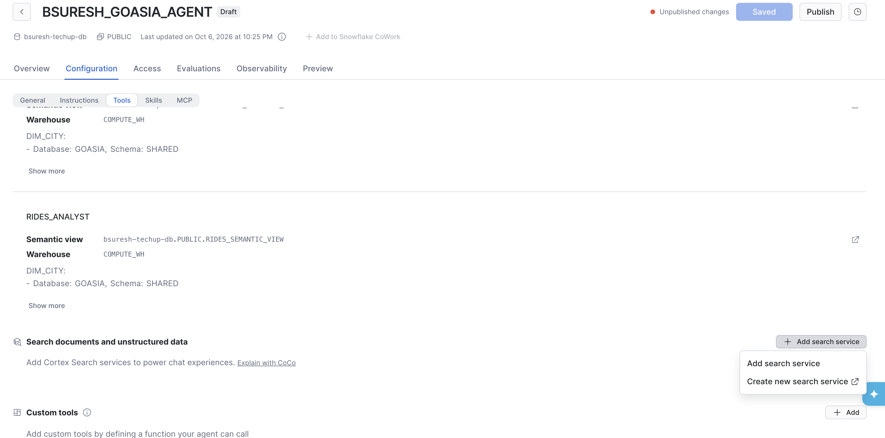
  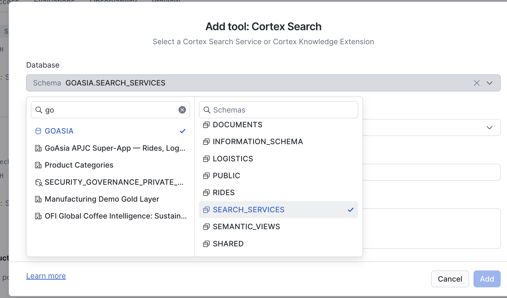
  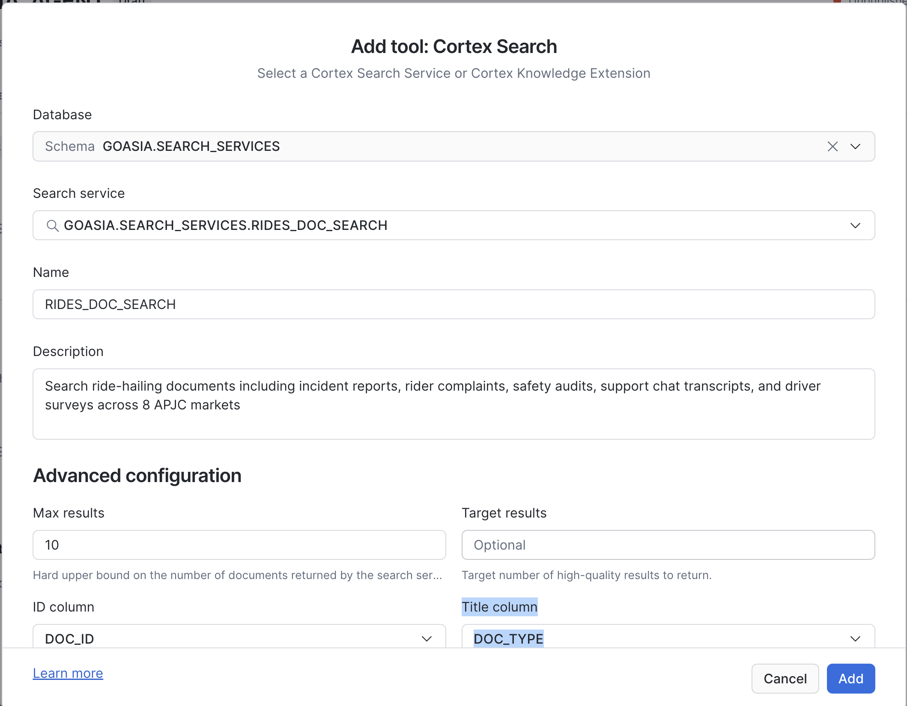
</p>

#### Step 5: Save and publish the agent

1. Click **Save** (top right).
2. Click **Publish**. In the dialog, leave **Use this version** selected, then click **Publish**.

<p align="center">
  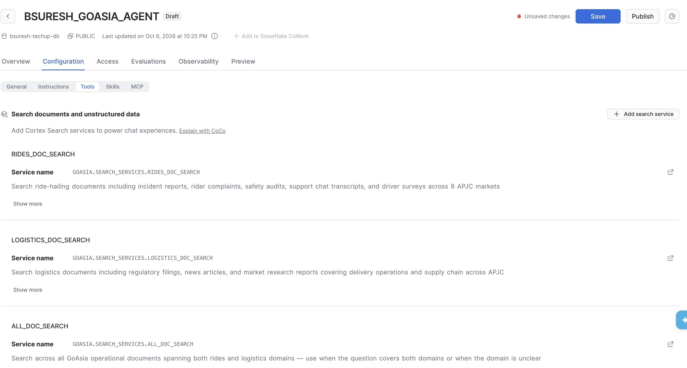
  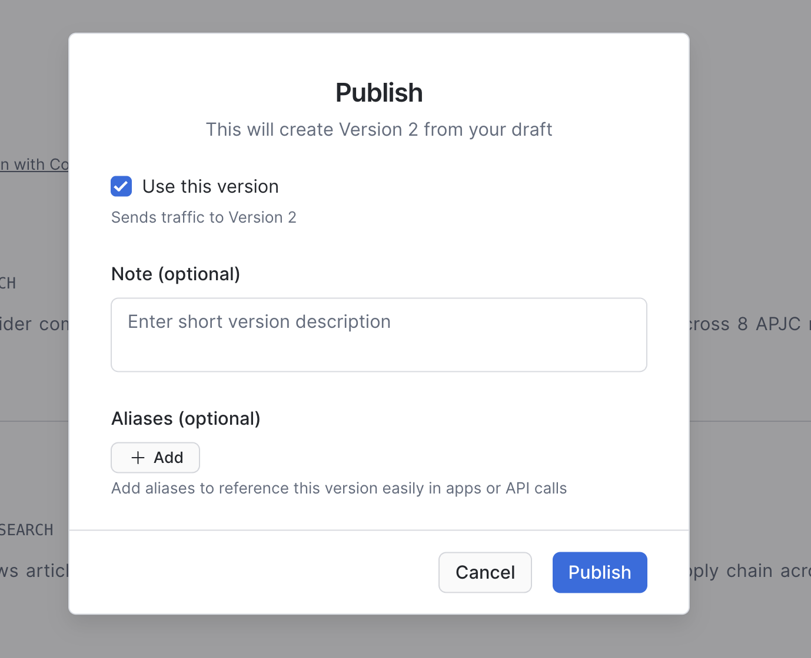
</p>

---

### 4.5 Add the agent to Snowflake CoWork

1. In **Agent Studio**, open the **Snowflake CoWork** tab and click **Review agents**.
2. Click **Add existing agent**, select `<first initial><surname>_goasia_agent` and add it. Confirm that the agent appears in the list.

<p align="center">
  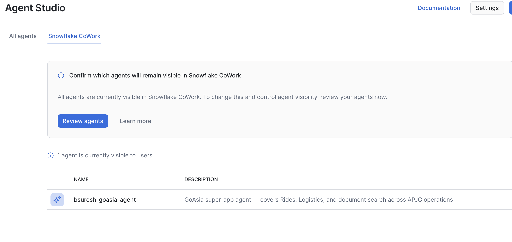
  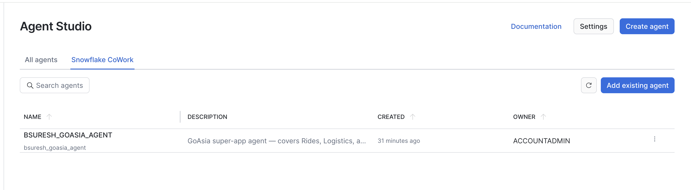
</p>

3. In the left navigation, go to **AI & ML » Snowflake CoWork**. CoWork opens in a new tab.
4. In the chat box, open the agent picker and select `<first initial><surname>_goasia_agent`.

<p align="center">
  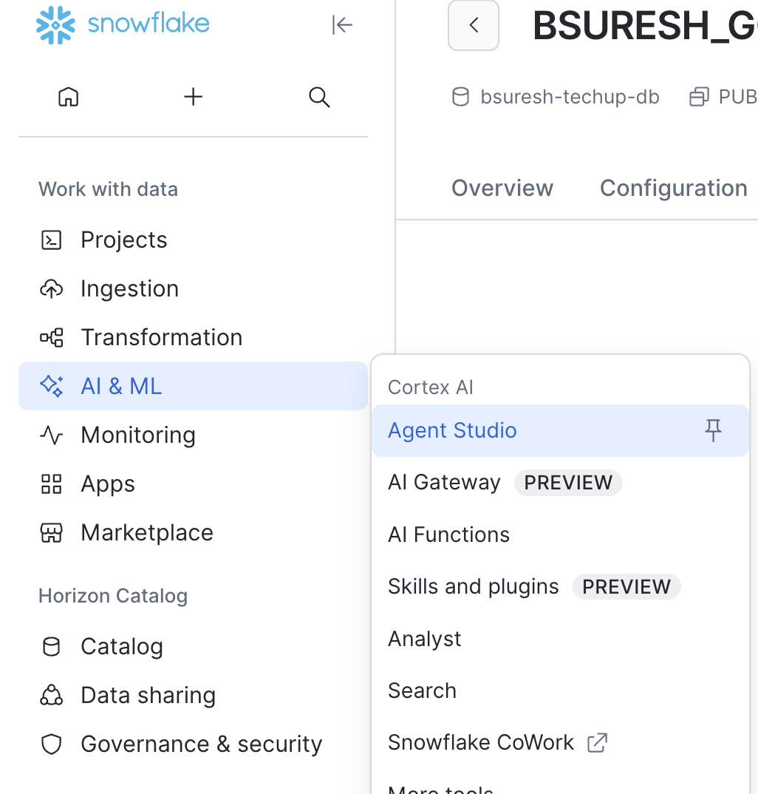
  
</p>

> [!IMPORTANT]
> **Stop here.** Leave the CoWork tab open with your agent selected, but don't ask it anything yet. You'll return to this tab in [Section 6](#6-compare-the-results) to run the benchmark questions.

---

## 5. Databricks

In this part you will:

1. Log in, create a notebook and create your own schema.
2. Use **Genie Code** to build the **Rides** and **Logistics** metric views.
3. Create two **Genie agents**, one for Rides and one for Logistics.
4. Create a **Supervisor Agent** that routes questions to the two Genie agents and the `goasia-operational-docs` Knowledge Assistant.

The same GoAsia data is loaded into Unity Catalog.

### 5.1 Log in and verify access

| Item | Value |
|---|---|
| Workspace URL | `<DATABRICKS_WORKSPACE_URL>` |
| Login | Your Entra ID |
| Catalog / Shared schema | `apjtechup26` / `techup-hol` |
| Volume (source files) | `/Volumes/apjtechup26/techup-hol/techup-data/` |
| Your schema | `<first initial><surname>-schema` |

> [!NOTE]
> Schema names that contain a hyphen must be wrapped in backticks, for example `` `apjtechup26`.`techup-hol`.fact_trip ``.

#### Step 1: Log in and create your notebook

1. Open the workspace URL above and sign in with your **Entra ID**.
2. In the left sidebar, open **Catalog** and expand **`apjtechup26` » `techup-hol`**. You should see 22 tables.
3. Click **+ New » Notebook**, then click the notebook title and rename it `<first initial><surname>-notebook`.
4. Open the compute drop-down at the top right of the notebook and select **Serverless**.

<p align="center">
  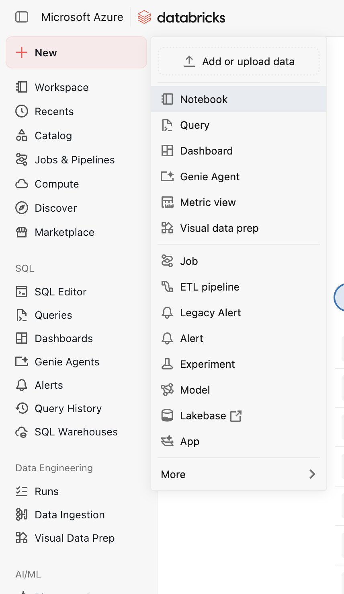
  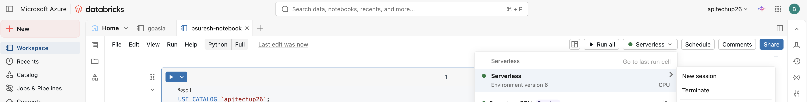
</p>

#### Step 2: Verify access

The notebook's default language is Python, so start each cell with `%sql`. Run each block below in **its own cell**, and check the result before you move on.

**Cell 1:** set the context and confirm it. Expect your user, `apjtechup26` and `techup-hol`.

```sql
%sql
USE CATALOG `apjtechup26`;
USE SCHEMA `techup-hol`;
SELECT current_user(), current_catalog(), current_schema();
```

**Cell 2:** list the tables. Expect 22 rows.

```sql
%sql
SHOW TABLES;
```

**Cell 3:** check sample row counts. Expect 10 / 50,000,000 / 50,000,000.

```sql
%sql
SELECT
  (SELECT COUNT(*) FROM dim_country)    AS countries,
  (SELECT COUNT(*) FROM fact_trip)      AS trips,
  (SELECT COUNT(*) FROM fact_shipment)  AS shipments;
```

**Cell 4:** check access to the volume. Expect a list of source files.

```sql
%sql
LIST '/Volumes/apjtechup26/techup-hol/techup-data/';
```

> [!WARNING]
> If a later cell fails with *TABLE_OR_VIEW_NOT_FOUND*, run Cell 1 again. Its `USE` statements set the context for the session.

#### Step 3: Create your own schema

You'll build your metric views in your own schema inside `apjtechup26`.

**Cell 5:** create the schema and set it as your context. Replace `<first initial><surname>` with your prefix. The last column of the result should show your schema name.

```sql
%sql
CREATE SCHEMA IF NOT EXISTS `apjtechup26`.`<first initial><surname>-schema`;
USE CATALOG `apjtechup26`;
USE SCHEMA `<first initial><surname>-schema`;
SELECT current_user(), current_catalog(), current_schema();
```

<p align="center">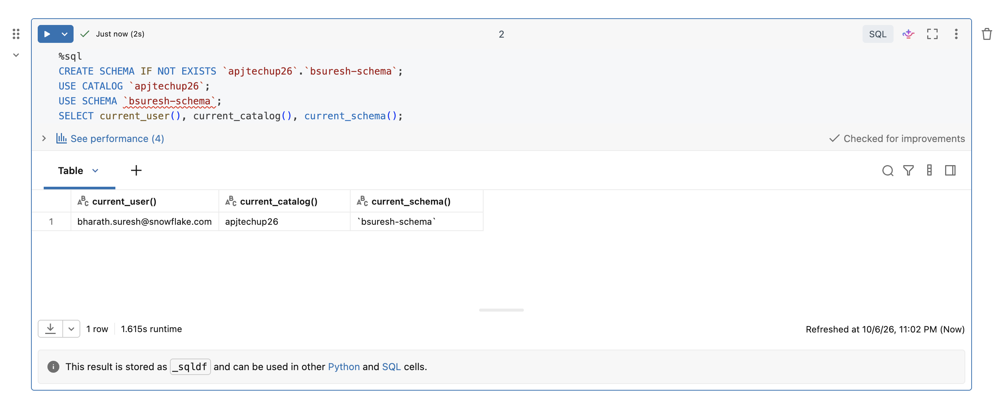</p>

> [!NOTE]
> Your own schema is now the default. Refer to shared tables by their full name, for example `` `apjtechup26`.`techup-hol`.fact_trip ``.

#### Step 4: Check the Knowledge Assistant

In the left sidebar, go to **AI/ML » Agents** and check that the `goasia-operational-docs` Knowledge Assistant is visible.

### 5.2 Reference: source data in Unity Catalog

This section describes the data you'll work with. There are no steps here.

**Tables.** All 22 GoAsia tables are in a **single schema**, `apjtechup26`.`techup-hol`, with the same names in lowercase (`dim_country`, `fact_trip`, `fact_shipment` and so on). The row counts match Snowflake.

**Knowledge Assistant.** `goasia-operational-docs` is already built over the same eight document types:

| Field | Value |
|---|---|
| Name | `goasia-operational-docs` |
| Rides documents | Incident reports (INC-), rider complaints (CMP-), safety audits (SA-), support chats (CS-), driver surveys (SRV-) |
| Logistics documents | Regulatory filings (REG-), news (NEWS-), market research (RESEARCH-) |
| Behaviour | Answers document questions with specific references (IDs, dates, cities). Quantitative questions go to the structured tables. |

---

### 5.3 Create the metric views with Genie Code

Genie Code is the Databricks AI assistant. You'll ask it to build both metric views in your schema. It writes the `CREATE VIEW ... WITH METRICS` code into a new notebook cell and runs the cell for you.

#### Step 1: Create `rides_metric_view`

1. In your notebook, click the **Genie Code** icon at the top right, next to the catalog name. The Genie Code panel opens on the right.
2. Paste this prompt into the chat box, replace `<first initial><surname>-schema` with your schema name, and press **Enter**:

   ```text
   Create a metric view in <first initial><surname>-schema called rides_metric_view using these tables from apjtechup26.techup-hol
   fact_trip, dim_driver, dim_rider, dim_vehicle, dim_zone, dim_city, dim_country. Include necessary relationships.
   ```

3. Genie Code reads the table schemas and works out these relationships. While it works, the panel shows **Editing `<your notebook>`**.
   - `fact_trip` → `dim_rider`, `dim_driver`, `dim_vehicle`
   - `fact_trip` → `dim_zone`, twice (pickup and drop-off)
   - `dim_zone` → `dim_city` → `dim_country`

<p align="center">
  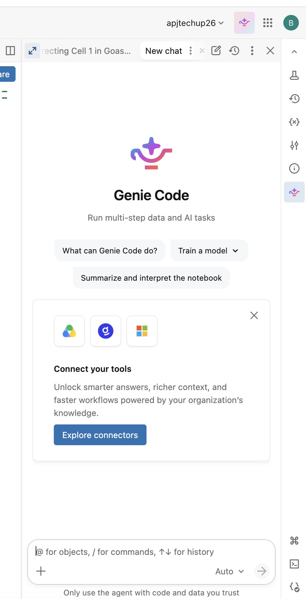
  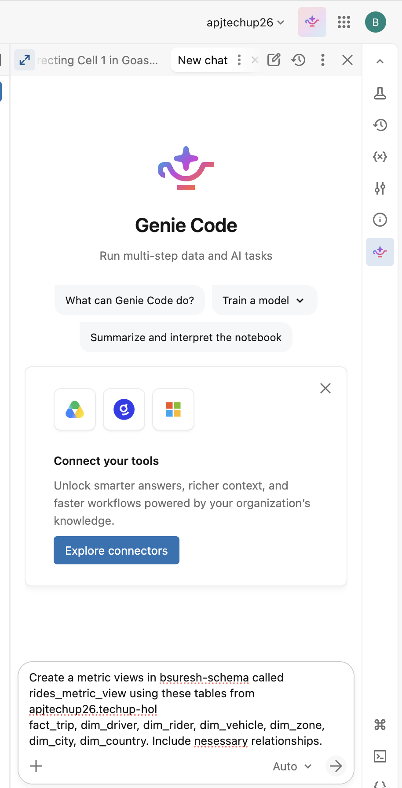
  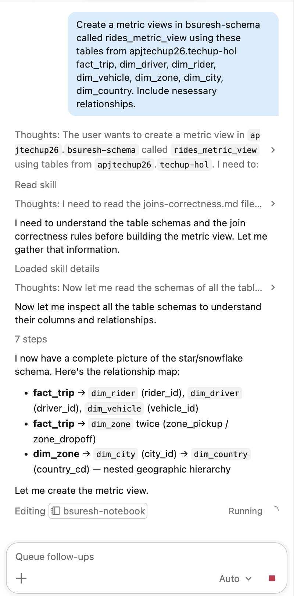
</p>

4. A new cell, **Create rides_metric_view**, is added to your notebook and runs automatically. Wait for the green tick. Genie Code usually adds a validation cell that queries the view with `MEASURE()`. It should return trip counts, completion rates and fares by country and city.

<p align="center">
  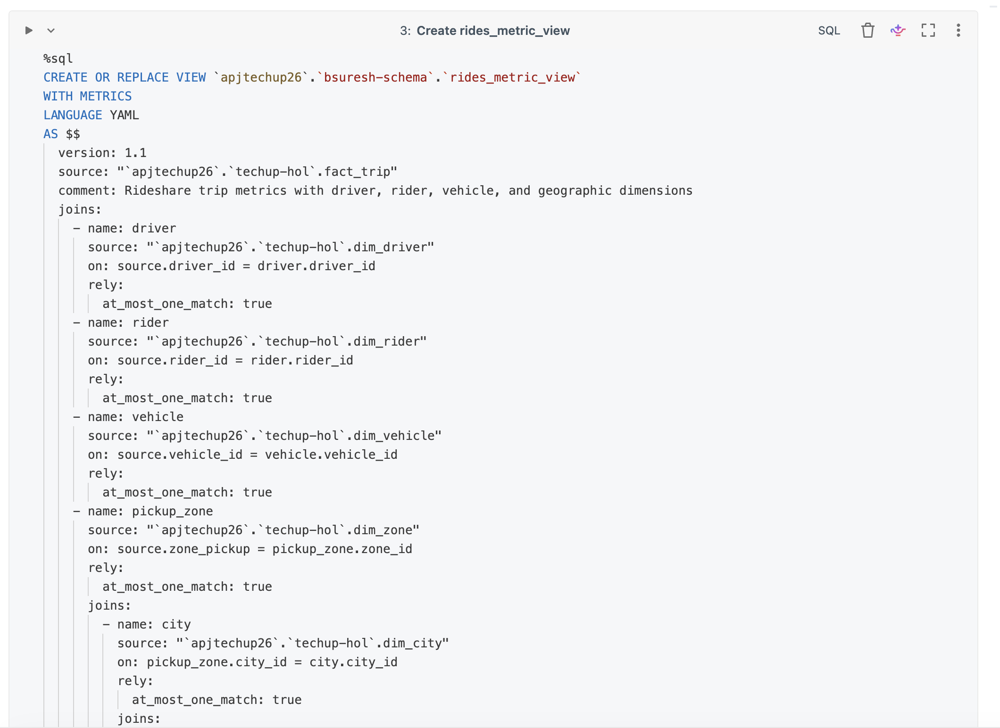
  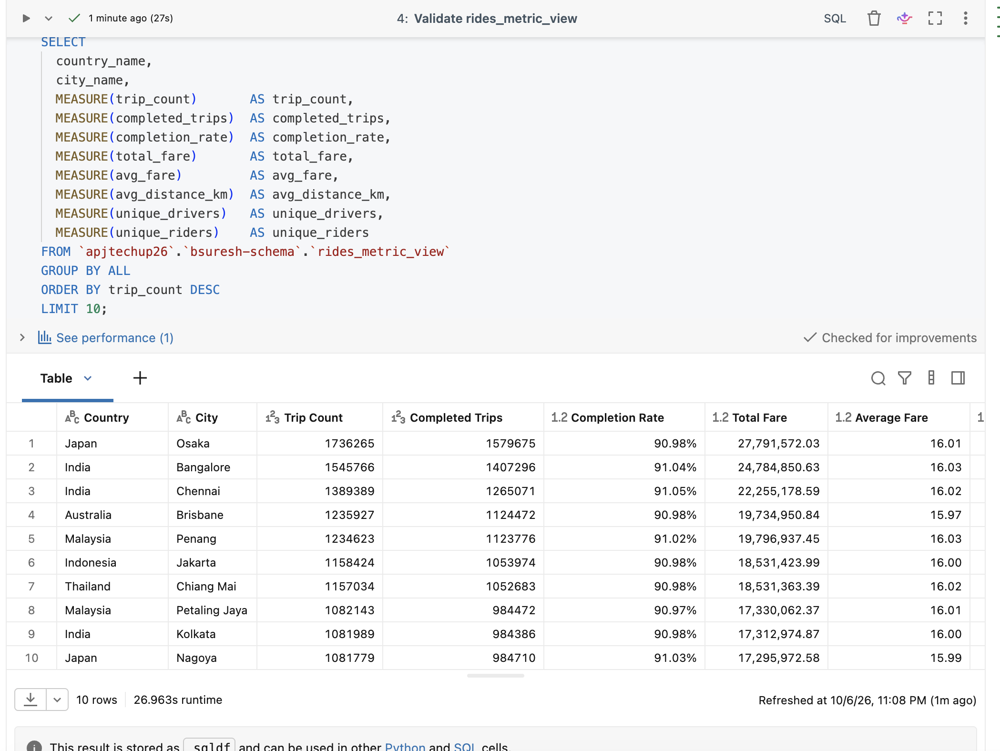
</p>

> [!TIP]
> If Genie Code asks for approval before running a cell, approve it. If a cell fails, ask Genie Code to fix the error.

#### Step 2: Create `logistics_metric_view`

In the same chat, send this prompt with your schema name:

```text
Create a metric view in <first initial><surname>-schema called logistics_metric_view using these tables from apjtechup26.techup-hol
fact_shipment, dim_shipper, dim_courier, dim_parcel_type, dim_warehouse, dim_city, dim_country. Include necessary relationships.
```

A new **Create logistics_metric_view** cell is added and runs automatically. Check that it completes and that the validation query returns shipment metrics.

---

### 5.4 Create the Genie agents

You'll create two Genie agents, one for Rides and one for Logistics. Each uses tables from the shared `techup-hol` schema plus the metric view in your own schema.

| Agent | Name | Sources (13 objects) |
|---|---|---|
| Rides | `<first initial><surname> - GoAsia Rides Agent` | **`techup-hol` (12):** `fact_trip`, `dim_driver`, `dim_rider`, `dim_vehicle`, `fact_trip_event`, `fact_surge_pricing`, `fact_driver_earning`, `fact_rider_payment`, `fact_promo_usage`, `dim_city`, `dim_country`, `dim_zone`<br>**`<first initial><surname>-schema` (1):** `rides_metric_view` |
| Logistics | `<first initial><surname> - GoAsia Logistics Agent` | **`techup-hol` (12):** `fact_shipment`, `dim_shipper`, `dim_courier`, `dim_warehouse`, `dim_parcel_type`, `fact_parcel_event`, `fact_route_leg`, `fact_sla_breach`, `fact_courier_earning`, `fact_shipper_invoice`, `dim_city`, `dim_country`<br>**`<first initial><surname>-schema` (1):** `logistics_metric_view` |

#### Step 1: Create the Rides agent

1. In the left sidebar, under **SQL**, click **Genie Agents**, then click **+ New** (top right).

<p align="center">
  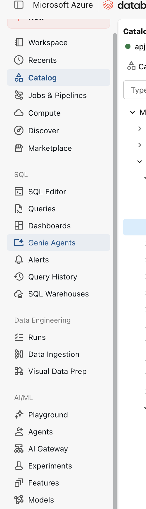
  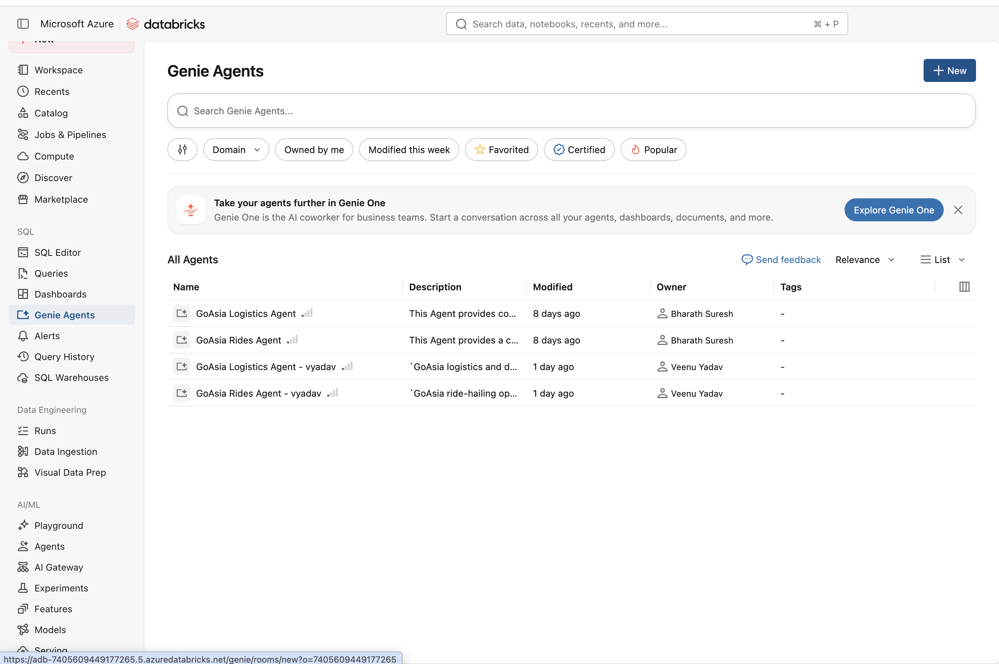
</p>

2. In **Connect your data**, search for and select the 13 Rides objects listed above. The 12 tables come from the **shared** schema `apjtechup26`.`techup-hol`. The metric view comes from **your** schema.

   > **Important: Check the schema shown next to each search result. Select tables from `apjtechup26`.`techup-hol` only, never a copy in another participant's schema. To find your metric view quickly, use the Metric views filter.**

3. Check that **Selected** shows **13**, then click **Create**. When the agent opens, click **Configure**.
4. **Name the agent.** On the **About** tab, scroll to **About this agent** and click the pencil icon. Set **Name** to `<first initial><surname> - GoAsia Rides Agent`, check that **Warehouse** shows your SQL warehouse, and save.

   > **Important:** The workspace is shared. Your prefix keeps your agent distinct from other participants' agents.

<p align="center">
  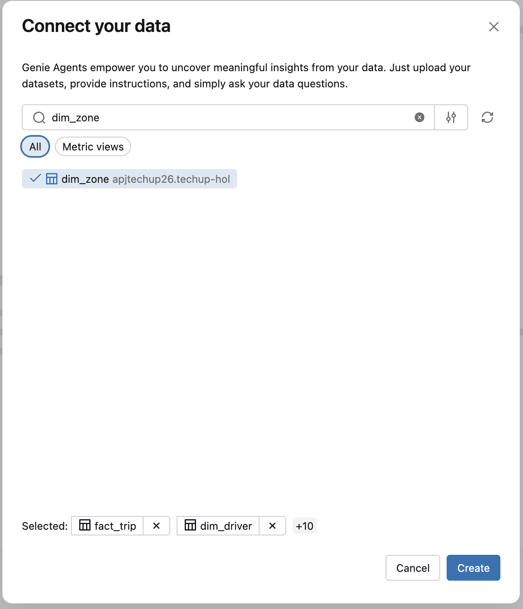
  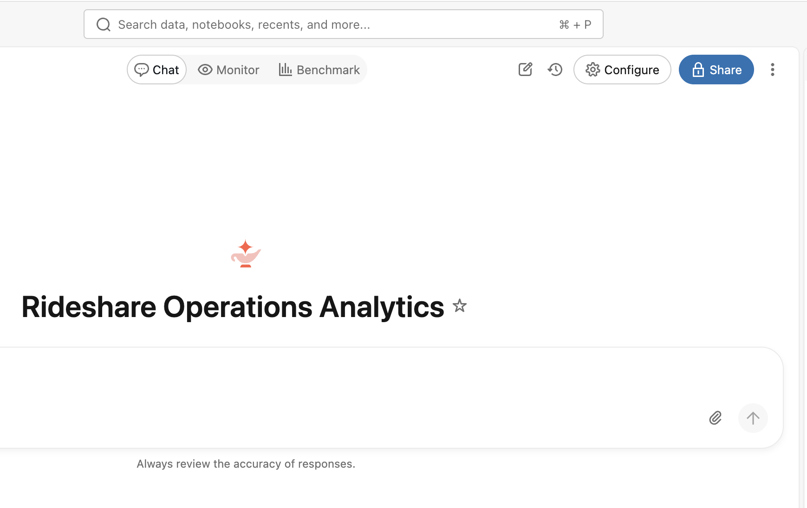
  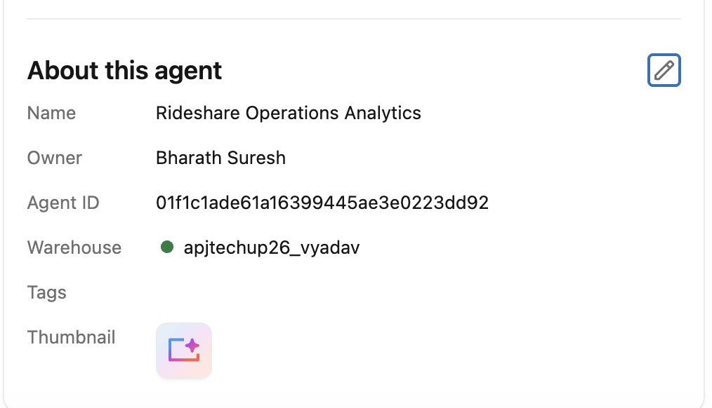
</p>

5. On the **About** tab, accept the description that Genie generated.
6. On the **Instructions** tab, click **Generate with Genie** and enter:

   ```text
   Generate instructions for this Genie space based on all the tables added.
   ```

   Review the generated instructions, then click **Save**.

   > **Important: Genie can generate very long instructions. If it does, click Generate with Genie again and ask for a shorter version:**
   >
   > ```text
   > Condense these instructions into a shorter version that keeps only the key business rules, joins and definitions.
   > ```
   >
   > Review the condensed version, then click **Save**.

7. Keep all other defaults. Don't add custom synonyms or SQL examples.

<p align="center">
  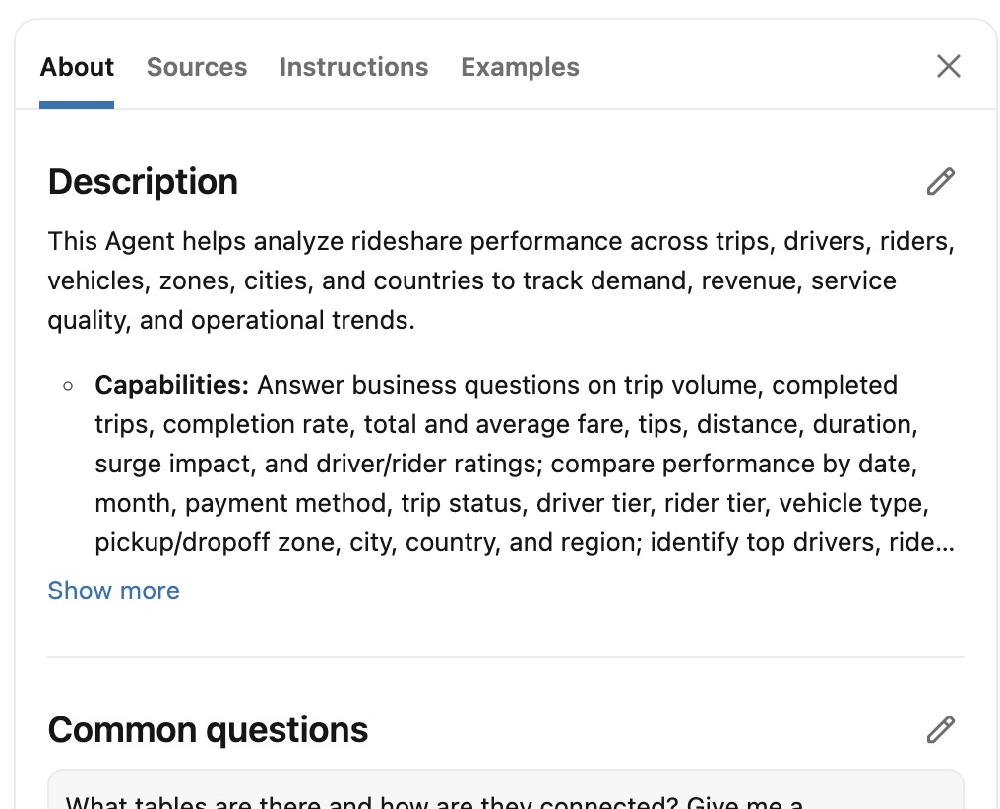
  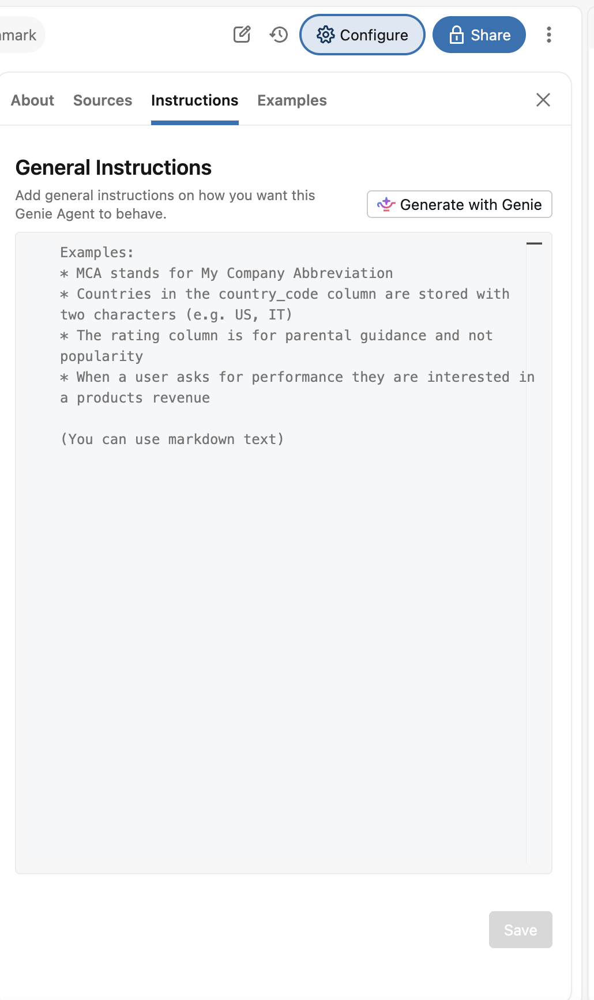
</p>

#### Step 2: Create the Logistics agent

Go back to **Genie Agents**, click **+ New**, and repeat Step 1 with the 13 Logistics objects listed above. As before, **set the name in About this agent after you click Create.**

| Setting | Value |
|---|---|
| Name | `<first initial><surname> - GoAsia Logistics Agent` |
| Description | `GoAsia logistics and delivery operations across 8 APJC countries` |
| Warehouse | Your SQL warehouse |

Then go to **Configure » Instructions**, click **Generate with Genie** and enter:

```text
Generate instructions for this Genie space based on all the tables added.
```

If the instructions are very long, ask Genie for a condensed version, as you did for the Rides agent. Click **Save**. Keep all other defaults, and don't add custom synonyms or SQL examples.

---

### 5.5 Create the Supervisor Agent

The Supervisor Agent sends each question to the right sub-agent: your Rides Genie agent, your Logistics Genie agent, or the `goasia-operational-docs` Knowledge Assistant.

#### Step 1: Create and name the Supervisor Agent

1. In the left sidebar, under **AI/ML**, click **Agents**, then click **Create Agent** (top right).
2. In the **Create new Agent** dialog, select **Supervisor Agent**.

<p align="center">
  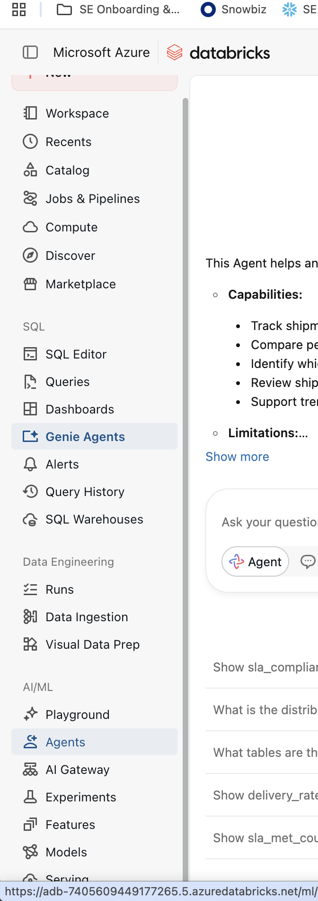
  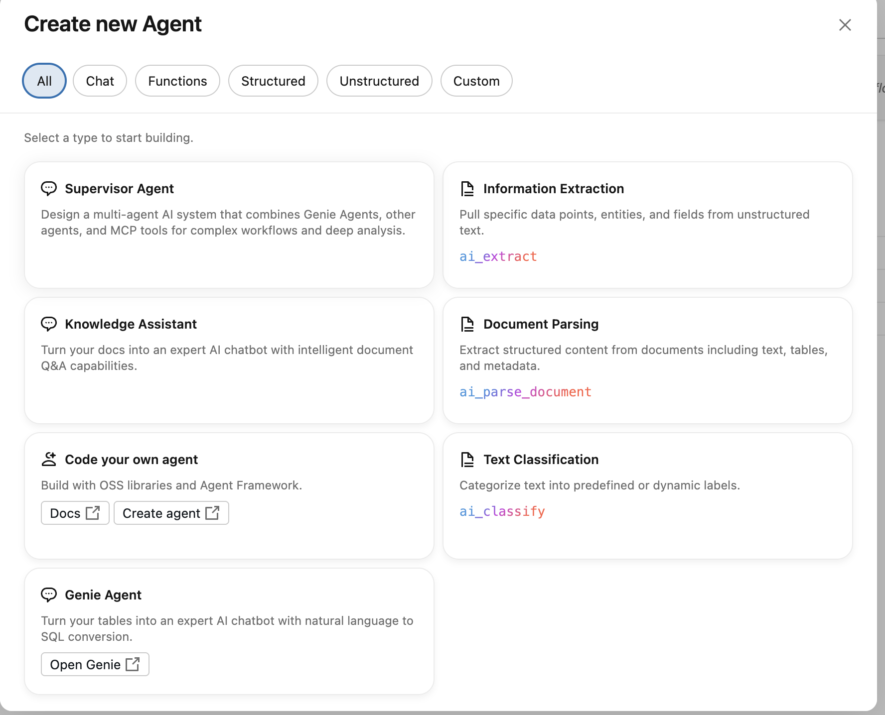
</p>
<p align="center">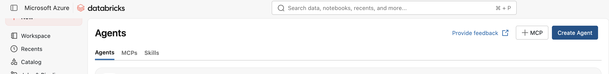</p>

3. On the **New Supervisor Agent** page, click the pencil icon next to the title and rename the agent `<first initial><surname>-GoAsia-APJC-Agent` (for example, `jdoe-GoAsia-APJC-Agent`). The builder saves changes automatically, and the header shows **Last saved …**.

<p align="center">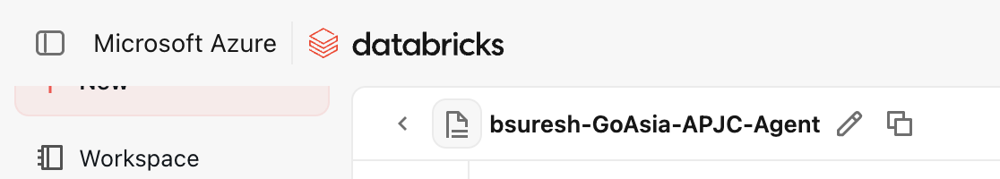</p>

#### Step 2: Add the sub-agents and remove all other tools

1. Under **Tools and sub-agents**, click the search box and select the **Genie Agents** filter, or type `type:genie`.
2. Select `<first initial><surname> - GoAsia Rides Agent`, then open the search box again and select `<first initial><surname> - GoAsia Logistics Agent`.

   > **Important: The list includes every participant's Genie agents, and many names look alike. Select only the two agents with your prefix. If a name is cut off, hover over it to see the full name.**

3. In the search box, select the **Knowledge Assistants** filter or type `type:ka`, then select `goasia-operational-docs`. A check mark confirms that it was added.

   > **Important: The Supervisor needs the Knowledge Assistant to answer document questions. Don't skip this step.**

4. The builder adds placeholder rows by default: **Add a UC MCP Service**, **Add a Volume**, **Add a Databricks App** and **Add a Serving Endpoint**. Remove all of them. Exactly three items should remain under **Tools and sub-agents**:

| # | Tool | Type |
|---:|---|---|
| 1 | `<first initial><surname> - GoAsia Rides Agent` | Genie Agent |
| 2 | `<first initial><surname> - GoAsia Logistics Agent` | Genie Agent |
| 3 | `goasia-operational-docs` | Knowledge Assistant |

<p align="center">
  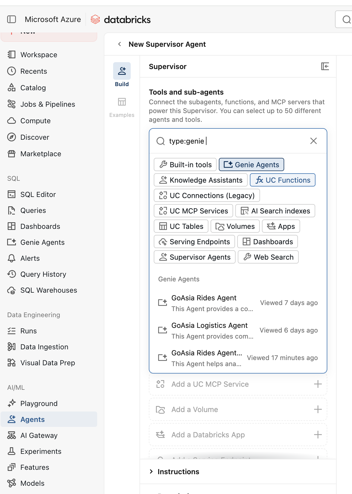
  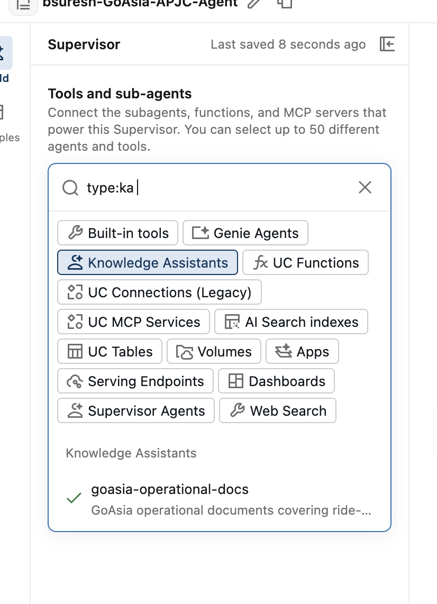
</p>

#### Step 3: Set the instructions and description

1. Expand **Instructions** and paste the text below. Replace `<first initial><surname>` with your prefix, so the agent names match your Genie agents exactly.

   ```text
   You are GoAsia's data assistant covering ride-hailing and logistics operations across 8 APJC markets (Singapore, Malaysia, Thailand, Philippines, Vietnam, Indonesia, India, Japan).

   TOOL ROUTING:
   - Rides questions (trips, fares, drivers, riders, surge pricing, payments, promos) → use <first initial><surname> - GoAsia Rides Agent
   - Logistics questions (shipments, shippers, couriers, warehouses, SLA, invoices, routes) → use <first initial><surname> - GoAsia Logistics Agent
   - Document questions (incidents, complaints, audits, surveys, regulations, news) → use goasia-knowledge-base
   - Cross-domain questions → call both Rides and Logistics agents and combine results
   - When unsure which domain, ask the user to clarify rides or logistics
   ```

2. Expand **Description** (below **Instructions**) and paste:

   ```text
   GoAsia super-app agent covering ride-hailing and logistics operations across 8 APJC markets. Routes structured data questions to domain-specific Genie Agents and document questions to Knowledge Assistant.
   ```

3. Leave all other settings at their defaults, and wait for **Last saved** to update.

<p align="center">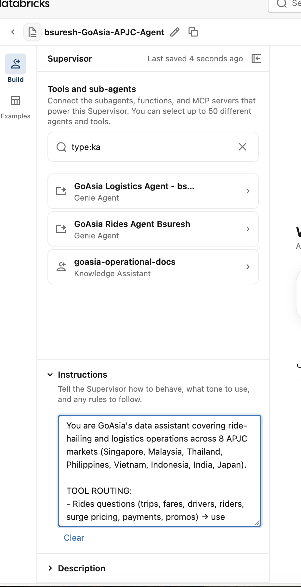</p>

---

## 6. Compare the results

Ask your Snowflake agent and your Databricks agent the same benchmark questions, then compare how accurate each answer is. The questions and expected answers come from `benchmark_test_questions.md`.
